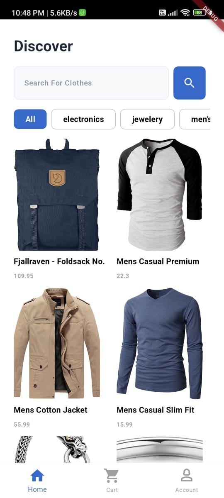
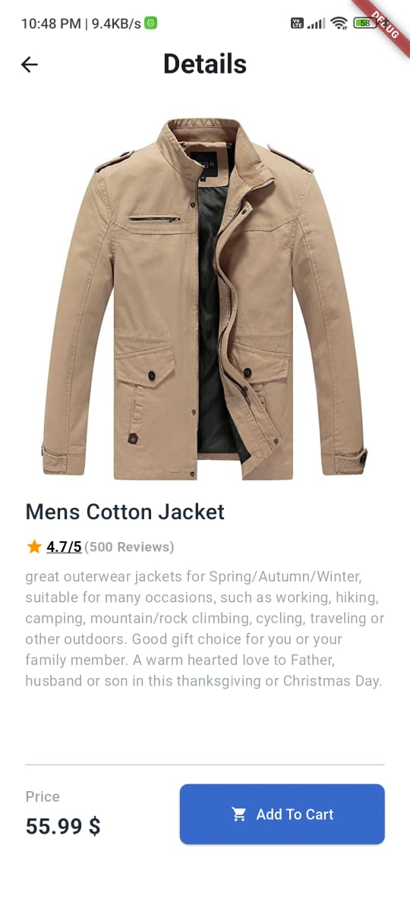
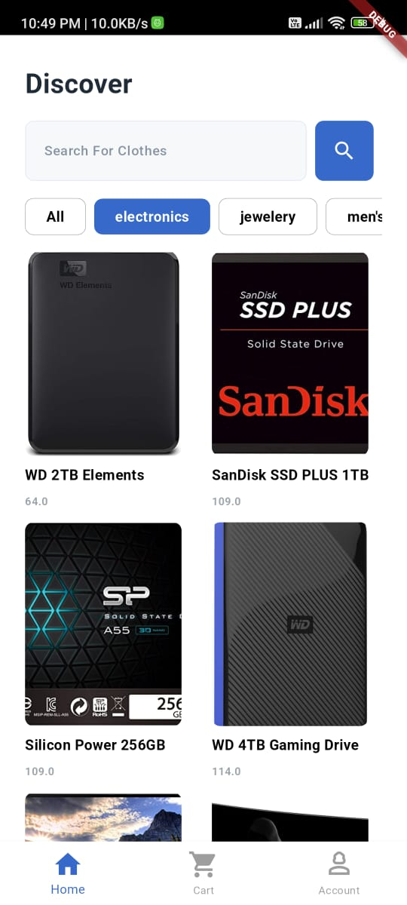
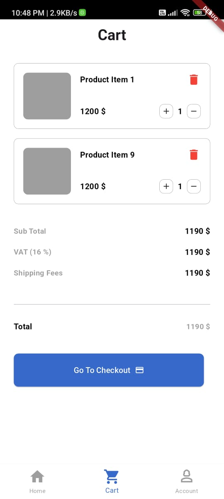

# 🛍️ Flutter E-commerce App

A modern e-commerce application built with Flutter following Clean Architecture principles, providing a seamless shopping experience with robust features and an elegant UI.


## 📱 App Preview

<p align="center">
  <!-- Add your screenshots here -->
  
  
  
  
  
</p>

## ✨ Features

- **👤 User Authentication**
  - Email & Password login/signup
  - Social media integration
  - Profile management

- **🏪 Shopping Experience**
  - Product categorization
  - Advanced search & filters
  - Wishlist functionality
  - Shopping cart management

- **💳 Payment Integration**
  - Secure payment gateway
  - Multiple payment methods
  - Order tracking

- **🎨 UI/UX**
  - Material Design 3
  - Custom animations
  - Responsive layouts
  - Dark/Light theme

## 🏗️ Architecture

The project follows Clean Architecture principles with three main layers:

```
lib/
├── core/
│   ├── constants/
│   ├── errors/
│   ├── network/
│   └── utils/
├── features/
│   ├── auth/
│   │   ├── data/
│   │   ├── domain/
│   │   └── presentation/
│   ├── products/
│   ├── cart/
│   └── profile/
└── main.dart
```

### Clean Architecture Layers

1. **Presentation Layer**
   - Widgets
   - Pages
   - Cubit/Bloc

2. **Domain Layer**
   - Entities
   - Use Cases
   - Repository Interfaces

3. **Data Layer**
   - Models
   - Repositories
   - Data Sources

## 🛠️ Technologies & Tools

- **State Management**: Bloc/Cubit
- **Dependency Injection**: GetIt
- **Local Storage**: Hive
- **API Integration**: Dio
- **Payment**: Stripe
- **Analytics**: Firebase Analytics
- **Testing**: Unit & Widget Tests

## 🚀 Getting Started

### Prerequisites

- Flutter SDK (3.19.0 or higher)
- Dart SDK (3.0.0 or higher)
- Android Studio / VS Code
- Git

### Installation

1. Clone the repository
```bash
git clone https://github.com/eslamabid175/ecommerce_app_flutter.git
```

2. Navigate to project directory
```bash
cd ecommerce_app_flutter
```

3. Install dependencies
```bash
flutter pub get
```

4. Run the app
```bash
flutter run
```

## 📦 Dependencies

```yaml
dependencies:
  flutter:
    sdk: flutter
  # State Management
  flutter_bloc: ^8.1.3
  # Dependency Injection
  get_it: ^7.6.4
  # Local Storage
  hive: ^2.2.3
  hive_flutter: ^1.1.0
  # Network
  dio: ^5.4.0
  # UI Components
  flutter_screenutil: ^5.9.0
  cached_network_image: ^3.3.1
  # Payment
  flutter_stripe: ^14.0.0
  # Others...

dev_dependencies:
  flutter_test:
    sdk: flutter
  build_runner: ^2.4.8
  flutter_lints: ^3.0.1
  mockito: ^5.4.4
```

## 🔐 Environment Setup

Create a `.env` file in project root:

```env
API_BASE_URL=your_api_url
STRIPE_PUBLIC_KEY=your_stripe_key
```

## 🧪 Running Tests

```bash
# Unit Tests
flutter test

# Integration Tests
flutter test integration_test
```

## 📱 Supported Platforms

- Android
- iOS
- Web (responsive)

## 🤝 Contributing

1. Fork the Project
2. Create your Feature Branch (`git checkout -b feature/AmazingFeature`)
3. Commit your Changes (`git commit -m 'Add some AmazingFeature'`)
4. Push to the Branch (`git push origin feature/AmazingFeature`)
5. Open a Pull Request

## 👤 Author

**Eslam Abid**
- GitHub: [@eslamabid175](https://github.com/eslamabid175)

## 📝 License

This project is licensed under the MIT License - see the [LICENSE](LICENSE) file for details.

## 🙏 Acknowledgments

- Flutter team for the amazing framework
- All contributors who helped in this project
- [Material Design](https://material.io/) for the design guidelines

---
Last Updated: 2025-04-03 22:17:00 UTC by @eslamabid175
